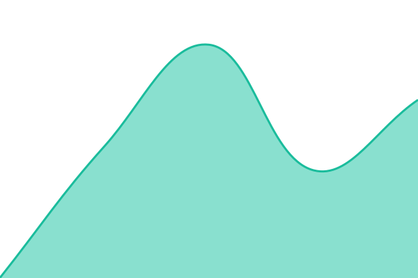

# [📈 Statut en direct](https://status.vigiao.fr): <!--live status--> **Tous les services sont opérationnels**

This repository contains the open-source uptime monitor and status page for [Léo Marques](https://status.vigiao.fr), powered by [Upptime](https://github.com/upptime/upptime).

With [Upptime](https://upptime.js.org), you can get your own unlimited and free uptime monitor and status page, powered entirely by a GitHub repository. We use [Issues](https://github.com/inotekk/status/issues) as incident reports, [Actions](https://github.com/inotekk/status/actions) as uptime monitors, and [Pages](https://status.vigiao.fr) for the status page.

## [📈 Live Status](https://demo.upptime.js.org): <!--live status--> **Tous les services sont opérationnels**

<!--start: status pages-->
<!-- This summary is generated by Upptime (https://github.com/upptime/upptime) -->
<!-- Do not edit this manually, your changes will be overwritten -->
<!-- prettier-ignore -->
| URL | Status | History | Response Time | Uptime |
| --- | ------ | ------- | ------------- | ------ |
|  [Application VIGIAO](https://ao.inotekk.com/api/v1/health) | En ligne | [application-vigiao.yml](https://github.com/inotekk/status/commits/HEAD/history/application-vigiao.yml) | 

 703ms
     
 | 

<a href="https://status.vigiao.fr/history/application-vigiao">100.00%</a>
    

|  [Veille marchés publics](https://vigi.inotekk.com/healthz) | En ligne | [veille-marches-publics.yml](https://github.com/inotekk/status/commits/HEAD/history/veille-marches-publics.yml) | 

 1212ms
     
 | 

<a href="https://status.vigiao.fr/history/veille-marches-publics">100.00%</a>
    

|  [Site vigiao.fr](https://vigiao.fr) | En ligne | [site-vigiao-fr.yml](https://github.com/inotekk/status/commits/HEAD/history/site-vigiao-fr.yml) | 

 3984ms
     
 | 

<a href="https://status.vigiao.fr/history/site-vigiao-fr">100.00%</a>
    

|  [Espace client](https://espace.vigiao.fr) | En ligne | [espace-client.yml](https://github.com/inotekk/status/commits/HEAD/history/espace-client.yml) | 

 644ms
     
 | 

<a href="https://status.vigiao.fr/history/espace-client">100.00%</a>
    

<!--end: status pages-->

[**Visit our status website →**](https://status.vigiao.fr)

## 📄 License

- Powered by: [Upptime](https://github.com/upptime/upptime)
- Code: [MIT](./LICENSE) © [Anand Chowdhary](https://anandchowdhary.com)
- Data in the `./history` directory: [Open Database License](https://opendatacommons.org/licenses/odbl/1-0/)
